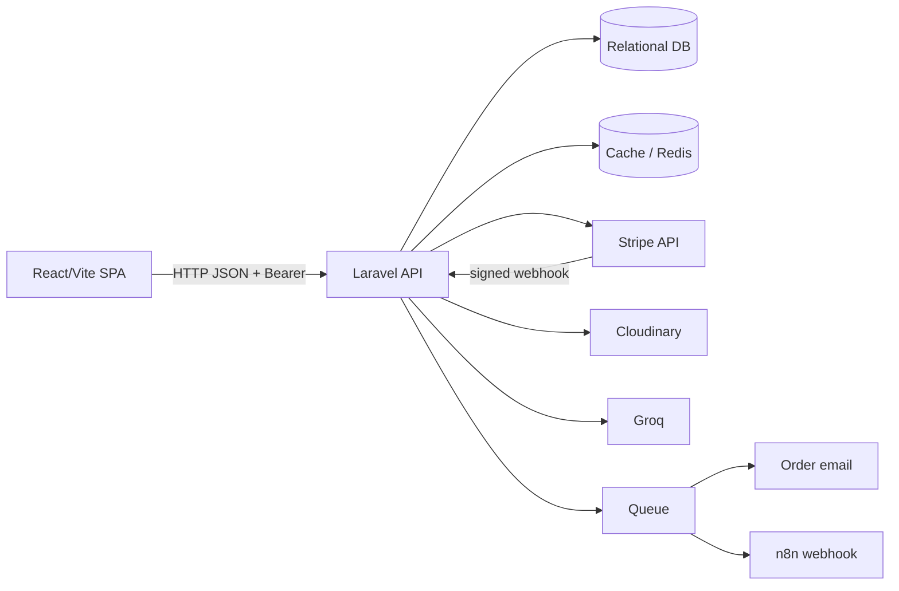

# Project Architecture and Codebase Audit

**Audit basis:** source inspection of `backend/app`, `backend/routes`, `backend/config`, `backend/database`, `backend/resources`, `backend/bootstrap`, `backend/tests`, and `frontend/src`, plus the backend/frontend manifests and environment examples. Vendor, `node_modules`, generated build output, and deployment/GitHub Actions material are out of scope. The working tree was already dirty; this audit does not attribute those changes or modify them.

**Status vocabulary:** `IMPLEMENTED` means an executable source path was found. `PARTIALLY IMPLEMENTED` means a meaningful path exists but has an incomplete contract or lifecycle. `ROUTE EXISTS / IMPLEMENTATION ISSUE` means registration exists but source shows a defect or mismatch. `IMPLEMENTED / ARCHITECTURAL CONCERN` means the behavior works in source but carries a material design risk. `Not verified from source code` means no reliable implementation or test evidence was found. `untested`, `unused`, `dead code`, and `questionable` are used literally where applicable.

## 1. Executive Summary

This is a two-application ecommerce system: a Laravel 13/PHP 8.3 API in `backend` and a separate React 19/Vite TypeScript SPA in `frontend`. The implemented business surface covers catalog browsing, customer authentication, carts, orders, cash-on-delivery and Stripe payment initiation, product images through Cloudinary, admin catalog/order management, a deterministic-plus-Groq product assistant, order email, and n8n notification.

The strongest paths are API resource shaping, Sanctum bearer-token authentication, admin middleware, locked checkout stock handling, Stripe signature verification and idempotent paid-state guard, and broad backend feature tests. The main risks are frontend/backend contract drift, permissive FormRequest authorization hidden behind route middleware, non-atomic cart mutation/cache invalidation, synchronous external dependency work inside a queued listener, missing frontend tests, incomplete payment/order failure lifecycle, and schema/factory drift.

## 2. Verified Technology Table

| Area | Verified technology | Evidence |
|---|---|---|
| Backend runtime | PHP `^8.3`, Laravel `^13.8` | [backend/composer.json](../backend/composer.json#L8-L15) |
| API auth | Laravel Sanctum `^4.3`, personal access tokens | [backend/composer.json](../backend/composer.json#L11-L13), [AuthController.php](../backend/app/Http/Controllers/Api/V1/Auth/AuthController.php#L25-L31) |
| Payments | `stripe/stripe-php ^21.2`, Stripe Elements client packages | [backend/composer.json](../backend/composer.json#L9-L14), [frontend/package.json](../frontend/package.json#L18-L20) |
| Media | `cloudinary/cloudinary_php ^3.1` | [backend/composer.json](../backend/composer.json#L8-L10) |
| Backend queue/cache | Laravel database defaults in example; Redis connections configured | [backend/.env.example](../backend/.env.example#L38-L48), [config/cache.php](../backend/config/cache.php#L18-L47), [config/queue.php](../backend/config/queue.php#L16-L43) |
| Frontend | React `^19.2.8`, React DOM, TypeScript, Vite | [frontend/package.json](../frontend/package.json#L14-L32) |
| Client data | TanStack React Query, Axios, Zustand | [frontend/package.json](../frontend/package.json#L17-L28), [frontend/src/lib/query-client.ts](../frontend/src/lib/query-client.ts#L1-L20) |
| Forms/validation | React Hook Form, Zod, resolvers | [frontend/package.json](../frontend/package.json#L15-L24) |
| UI | lucide-react, Tailwind CSS, Sonner | [frontend/package.json](../frontend/package.json#L17-L27) |
| Tests | PHPUnit 12/Laravel test suite; no frontend runner | [backend/phpunit.xml](../backend/phpunit.xml#L1-L28), [frontend/package.json](../frontend/package.json#L6-L8) |

## 3. System Context

```text
Browser / React SPA
    | Axios /api/v1, Bearer token
    v
Laravel API (backend)
    |-- relational database: users, catalog, carts, orders, payments
    |-- Redis or database cache for user carts
    |-- Stripe API and signed webhook
    |-- Cloudinary upload/delete API
    |-- Groq chat-completions API for intent/language only
    |-- queued OrderPlaced listener -> mail + n8n webhook
```

Mermaid equivalent:



## 4. Repository Topology

- `backend/`: Laravel application, HTTP API, configuration, migrations, factories, seeders, Blade email/view, and PHPUnit tests.
- `frontend/`: independent Vite React TypeScript SPA with API modules, query hooks, pages, components, contexts, store, and styles.
- `docs/`: existing project documentation plus this audit. Deployment/GitHub Actions are intentionally not analyzed.
- `backend/resources/js` and `backend/resources/css`: Laravel/Vite skeleton assets; the separate frontend is the active-looking client based on its own package/build conventions.

## 5. Backend Directory/File Architecture

- `backend/app/Http/Controllers/Api/V1`: versioned public/customer/admin controllers.
- `backend/app/Http/Requests`: catalog and auth validation objects.
- `backend/app/Http/Resources`: JSON contract serializers.
- `backend/app/Models`: `User`, `Category`, `Product`, `ProductImage`, `Cart`, `CartItem`, `Order`, `OrderItem`, `Payment`.
- `backend/app/Services`: checkout, cart cache, AI, and n8n integration.
- `backend/app/Events`, `Listeners`, `Mail`: order side effects.
- `backend/database/migrations`: base Laravel tables plus ecommerce evolution through 2026-08-24.
- `backend/tests/Feature`: API and integration tests; `backend/tests/Unit`: only the example unit test.
- `backend/config`, `bootstrap`, `routes`: framework and dependency wiring.

## 6. Frontend Directory/File Architecture

- `frontend/src/main.tsx`: active-looking entry; it imports the app/provider shell and calls `ReactDOM.createRoot` ([main.tsx](../frontend/src/main.tsx#L1-L181)).
- `frontend/src/app/App.tsx`, `providers.tsx`, `router.tsx`: shell, providers, and route tree.
- `frontend/src/pages`: storefront, auth, checkout/order, assistant, and admin screens.
- `frontend/src/components`: layouts, guards, commerce components, Stripe form, and UI primitives.
- `frontend/src/api`: Axios client and domain API functions.
- `frontend/src/hooks/queries`: React Query read/mutation adapters.
- `frontend/src/contexts/AuthContext.tsx`: token/user session state.
- `frontend/src/stores/ui.store.ts`: UI state; `lib`: errors, query client/keys, Stripe; `types`: API types.
- `frontend/src/main.tsx.backup`: alternate/dead-code candidate. It is not referenced by the Vite entry convention or package scripts; its contents should not be treated as active without an explicit build reference.

## 7. Runtime Entry and Bootstrap

Laravel routes API requests through [bootstrap/app.php](../backend/bootstrap/app.php#L1-L45), with providers listed in [bootstrap/providers.php](../backend/bootstrap/providers.php#L1-L10). `CloudinaryServiceProvider` binds a singleton configured from `services.cloudinary.url` ([CloudinaryServiceProvider.php](../backend/app/Providers/CloudinaryServiceProvider.php#L9-L18)). `AppServiceProvider` has no application bindings ([AppServiceProvider.php](../backend/app/Providers/AppServiceProvider.php#L9-L24)). The frontend root is `main.tsx`; Vite uses React and Tailwind plugins ([frontend/vite.config.mts](../frontend/vite.config.mts#L1-L18)).

## 8. Actual Route Table: Public

All API routes are under `/api/v1` according to route configuration/client base URL.

| Method | Path | Handler | Status |
|---|---|---|---|
| GET | `/health` | closure | `IMPLEMENTED` |
| GET | `/categories` | `CategoryController@index` | `IMPLEMENTED` |
| GET | `/categories/{category}` | `CategoryController@show` | `IMPLEMENTED` |
| GET | `/products` | `ProductController@index` | `IMPLEMENTED` |
| GET | `/products/{product}` | `ProductController@show` | `IMPLEMENTED` |
| GET | `/products/{product}/images` | `ProductImageController@index` | `IMPLEMENTED` |
| POST | `/stripe/webhook` | `StripeWebhookController@handle` | `IMPLEMENTED`, signature checked |
| POST | `/auth/register` | `AuthController@register` | `IMPLEMENTED` |
| POST | `/auth/login` | `AuthController@login` | `IMPLEMENTED` |

Evidence: [routes/api.php](../backend/routes/api.php#L16-L48) and [routes/api.php](../backend/routes/api.php#L126-L139).

## 9. Actual Route Table: Authenticated Customer

| Method | Path | Handler | Status |
|---|---|---|---|
| GET | `/auth/me` | `AuthController@me` | `IMPLEMENTED` |
| POST | `/auth/logout` | `AuthController@logout` | `IMPLEMENTED` |
| GET | `/cart` | `CartController@index` | `IMPLEMENTED` |
| POST | `/cart/items` | `CartController@store` | `IMPLEMENTED` |
| PUT | `/cart/items/{cartItem}` | `CartController@update` | `IMPLEMENTED` |
| DELETE | `/cart/items/{cartItem}` | `CartController@destroy` | `IMPLEMENTED` |
| POST | `/ai/product-assistant` | invokable `ProductAssistantController` | `IMPLEMENTED` |
| GET/POST | `/orders`, `/orders/{order}` | `OrderController@index/store/show` | `IMPLEMENTED` |
| GET | `/orders/{order}/payment` | `PaymentController@show` | `IMPLEMENTED` |
| PUT/PATCH | `/orders/{order}/payment` | `PaymentController@update` | `IMPLEMENTED / ARCHITECTURAL CONCERN` |
| POST | `/orders/{order}/payment/intent` | `StripePaymentController@createIntent` | `IMPLEMENTED` |

Evidence: [routes/api.php](../backend/routes/api.php#L50-L79). Ownership checks are controller-level in [OrderController.php](../backend/app/Http/Controllers/Api/V1/OrderController.php#L62-L75), [PaymentController.php](../backend/app/Http/Controllers/Api/V1/PaymentController.php#L14-L55), and [StripePaymentController.php](../backend/app/Http/Controllers/Api/V1/StripePaymentController.php#L13-L29).

## 10. Actual Route Table: Admin

Admin routes use `auth:sanctum` and `admin` middleware ([routes/api.php](../backend/routes/api.php#L81-L123)). They include category CRUD, product CRUD, product image upload/delete, payment update, admin order listing, and order-status update. Both PUT and PATCH are registered for several update operations. `AdminMiddleware` compares `user->role` to `admin` and returns 401/403 ([AdminMiddleware.php](../backend/app/Http/Middleware/AdminMiddleware.php#L11-L29)).

## 11. Authentication and Authorization Flow

Registration validates through `RegisterRequest`, creates a forced `customer`, and returns a Sanctum plain-text token. Login checks `Hash::check`; `/me` returns `UserResource`; logout deletes the current access token ([AuthController.php](../backend/app/Http/Controllers/Api/V1/Auth/AuthController.php#L16-L69)). `User` hides password/remember token and casts passwords as hashed ([User.php](../backend/app/Models/User.php#L15-L42)).

`PARTIALLY IMPLEMENTED`: no source evidence of email verification, password reset, token expiration, rate limiting, abilities/scopes, or login throttling. Sanctum expiration is null in [sanctum.php](../backend/config/sanctum.php#L40-L53). Admin role assignment is not exposed by the public registration path, which is appropriate, but the audit found no dedicated role-management path.

## 12. Catalog Flow

Guests list active categories/products and view product details. Admins create/update/delete categories and products. Product listing filters category, active state, search, and pagination in [ProductController.php](../backend/app/Http/Controllers/Api/V1/ProductController.php#L16-L82). Resources include category and image relationships when loaded ([ProductResource.php](../backend/app/Http/Resources/ProductResource.php#L10-L29)). Soft deletes exist for categories/products. `Not verified from source code`: a public product search contract beyond controller-supported parameters is not documented centrally.

## 13. Cart Flow

An authenticated client reads `/cart`; the controller first reads `CartCacheService`, otherwise creates/loads the cart and caches the resource. Add/update/delete validate quantity and stock, mutate the cart, and forget the user cache ([CartController.php](../backend/app/Http/Controllers/Api/V1/CartController.php#L21-L181)). Cart totals are calculated from current product price in [CartResource.php](../backend/app/Http/Resources/CartResource.php#L10-L21).

`IMPLEMENTED / ARCHITECTURAL CONCERN`: add/update do not lock product rows, so concurrent cart edits can race with stock changes. The cache is invalidated after mutation rather than transactionally coupled. The database unique constraint protects one product per cart ([2026_08_19_110209_add_unique_product_to_cart_items_table.php](../backend/database/migrations/2026_08_19_110209_add_unique_product_to_cart_items_table.php#L9-L16)).

## 14. Order and Inventory Flow

`OrderService` locks the cart and each product inside a database transaction, checks active state/stock, snapshots item name and price, creates order/payment/order items, decrements stock immediately for COD, clears COD cart, then dispatches `OrderPlaced` ([OrderService.php](../backend/app/Services/OrderService.php#L16-L134)). Stripe orders remain pending and retain the cart until the webhook confirms payment.

This is one of the better protected flows: stock is rechecked under row locks. `PARTIALLY IMPLEMENTED`: order cancellation/refund/restock transitions are not implemented in the visible service/controller path.

## 15. Stripe Payment Flow

The frontend creates an order, requests a PaymentIntent client secret, and confirms it through Stripe Elements ([CheckoutPage.tsx](../frontend/src/pages/CheckoutPage.tsx#L1-L130), [StripePaymentForm.tsx](../frontend/src/components/StripePaymentForm.tsx#L1-L75)). The backend checks order ownership, Stripe payment method, and paid state, creates a BDT PaymentIntent with order metadata, and stores its ID ([StripePaymentController.php](../backend/app/Http/Controllers/Api/V1/StripePaymentController.php#L13-L73)).

The webhook constructs a signed event from raw payload, handles succeeded/failed events, verifies amount, locks products, decrements inventory, marks payment/order paid, clears cart, and dispatches `OrderPlaced` ([StripeWebhookController.php](../backend/app/Http/Controllers/Api/V1/StripeWebhookController.php#L18-L177)). The paid guard makes repeated success delivery effectively idempotent. `IMPLEMENTED / ARCHITECTURAL CONCERN`: no event-ID persistence, currency comparison, explicit order state guard, or recovery path for payment success when stock becomes insufficient. Failure marks only payment failed; order status remains pending.

## 16. Cloudinary Media Flow

`ProductImageController@store` validates a 5 MB jpg/jpeg/png/webp upload, makes the first image primary, unsets prior primary images, uploads to a product folder, and stores secure URL plus Cloudinary public ID. Delete verifies URL product ownership, deletes remote asset, removes the row, and promotes the latest remaining image ([ProductImageController.php](../backend/app/Http/Controllers/Api/V1/ProductImageController.php#L23-L137)).

`IMPLEMENTED / ARCHITECTURAL CONCERN`: upload happens before database persistence without a compensating delete if the database write fails. The migrations contain both legacy `public_id` and `cloudinary_public_id` additions ([2026_08_19_123910_add_public_id_to_product_images_table.php](../backend/database/migrations/2026_08_19_123910_add_public_id_to_product_images_table.php#L9-L20), [2026_08_19_124805_add_cloudinary_public_id_to_product_images_table.php](../backend/database/migrations/2026_08_19_124805_add_cloudinary_public_id_to_product_images_table.php#L9-L23)); controller/resource use the latter. The `cloudinary:test` command exists but is not covered by a test ([TestCloudinary.php](../backend/app/Console/Commands/TestCloudinary.php#L15-L47)).

## 17. AI Product Assistant

The authenticated endpoint validates a required message up to 2,000 characters ([ProductAssistantController.php](../backend/app/Http/Controllers/Api/V1/ProductAssistantController.php#L14-L32)). `ProductAssistantService` parses deterministic intent, optionally calls Groq to normalize query terms, merges intent, retrieves only active/in-stock database products, returns no-results without calling the answer LLM, and falls back to deterministic text on Groq failure ([ProductAssistantService.php](../backend/app/Services/AI/ProductAssistantService.php#L27-L104)).

`ProductRetriever` applies category, price, brand, phrase, keyword, and structured positive/negative feature constraints, scores candidates, and returns up to five results ([ProductRetriever.php](../backend/app/Services/AI/Retrieval/ProductRetriever.php#L34-L265)). `ProductIntentParser` is a large deterministic dictionary/token parser; `AIQueryUnderstandingService` asks Groq for JSON-only normalized query/keywords/phrases and treats AI as intent normalization, not product truth ([AIQueryUnderstandingService.php](../backend/app/Services/AI/Intent/AIQueryUnderstandingService.php#L22-L122)).

`IMPLEMENTED / ARCHITECTURAL CONCERN`: candidates are bounded to 100 before PHP brand filtering, so a large catalog can omit matching brands. Groq request latency is on the API request path. `attributes` and `ai_tags` are schema/model-backed, but no enrichment job or admin mutation path for them was verified; broader AI product enrichment is `Not verified from source code`.

## 18. n8n Integration

`N8nService::orderPlaced` posts a small order/customer payload with optional `X-N8N-Webhook-Secret`, logs start/response, skips when URL is absent, times out after ten seconds, and throws unsuccessful responses ([N8nService.php](../backend/app/Services/Integrations/N8nService.php#L11-L58)). It is invoked by the queued `HandleOrderPlaced` listener after email ([HandleOrderPlaced.php](../backend/app/Listeners/HandleOrderPlaced.php#L11-L25)). `IMPLEMENTED`: tests fake HTTP, verify URL/header/payload, and verify missing URL skips. `Not verified from source code`: n8n workflow definitions, retries, signatures beyond the static header, and delivery persistence.

## 19. Events, Queue, Mail

`OrderPlaced` serializes an order and `HandleOrderPlaced` implements `ShouldQueue`; it loads the user, sends `OrderPlacedMail`, then calls n8n. The mailable renders `emails.orders.placed` ([OrderPlaced.php](../backend/app/Events/OrderPlaced.php#L9-L15), [OrderPlacedMail.php](../backend/app/Mail/OrderPlacedMail.php#L10-L23)). Queue configuration defaults to database, while PHPUnit forces sync ([config/queue.php](../backend/config/queue.php#L16-L43), [phpunit.xml](../backend/phpunit.xml#L20-L26)).

`IMPLEMENTED / ARCHITECTURAL CONCERN`: the listener is queued but its mail and n8n calls are sequential; no explicit backoff, retry limit, unique job, or `afterCommit` configuration was found. A listener failure after email but before n8n can duplicate email on retry. The Blade email exists; mail delivery in a real environment is `Not verified from source code`.

## 20. Redis and Cache

Laravel config defines Redis `default` and `cache` connections using `REDIS_*` variables ([database.php](../backend/config/database.php#L145-L180)); default cache is database unless overridden ([cache.php](../backend/config/cache.php#L18-L47)). `CartCacheService` uses a user-specific key and a 30-minute lifetime ([CartCacheService.php](../backend/app/Services/CartCacheService.php#L9-L44)). Actual production Redis selection is `Not verified from source code`; the example environment selects database cache.

## 21. Database Schema Overview

Core tables are users, password reset tokens, sessions, cache, jobs, failed jobs, personal access tokens, categories, products, product images, carts, cart items, orders, order items, and payments. Ecommerce migrations create foreign keys and soft deletes where applicable. Product JSON columns are `attributes` and `ai_tags` ([2026_08_23_214343_add_attributes_to_products_table.php](../backend/database/migrations/2026_08_23_214343_add_attributes_to_products_table.php#L9-L20), [2026_08_24_120447_add_ai_tags_to_products_table.php](../backend/database/migrations/2026_08_24_120447_add_ai_tags_to_products_table.php#L12-L29)).

`questionable`: `OrderItemFactory` supplies `subtotal`, while the migration has `price` and nullable `unit_price` but no `subtotal` ([OrderItemFactory.php](../backend/database/factories/OrderItemFactory.php#L21-L28), [create_order_items_table.php](../backend/database/migrations/2026_08_01_000004_create_order_items_table.php#L11-L20)). `Payment` has both `method` and `payment_method`; checkout writes both, while factory writes only `method` ([Payment.php](../backend/app/Models/Payment.php#L13-L28), [PaymentFactory.php](../backend/database/factories/PaymentFactory.php#L16-L26)).

## 22. Models and Relationships

- `User`: has one cart, many orders, Sanctum tokens, hidden secrets, hashed password ([User.php](../backend/app/Models/User.php#L15-L42)).
- `Category`: has many products; soft deletion is present in model and migration.
- `Product`: belongs to category; has images, cart items, order items; soft deletes; casts price/stock/active/ai_tags ([Product.php](../backend/app/Models/Product.php#L11-L71)). Delete callback deletes images.
- `ProductImage`: belongs to product; casts primary boolean.
- `Cart`/`CartItem`: user/cart/product ownership relations.
- `Order`: belongs to user; has items and one payment; soft deletes.
- `OrderItem`: belongs to order/product and stores product snapshot fields.
- `Payment`: belongs to order and casts amount/paid time.

No model policies, observers beyond the product delete callback, or domain state objects were verified.

## 23. API Resources and Contract Shape

Resources expose stable `data` members through Laravel JSON resources: user identity/role, category metadata/count, product/category/images, cart items/total, order totals/shipping/items, payment details, and image metadata. Product resource does **not** expose `ai_tags` or `attributes` even though the model casts them. `PaymentResource` supports both method column names, signaling migration drift. Pagination uses Laravel resource collection conventions in product/order/admin list paths.

## 24. Validation Requests

`RegisterRequest` and `LoginRequest` validate credentials. Store/update category and product requests generate slugs when absent and enforce uniqueness/active category rules. Their `authorize()` methods all return true ([StoreProductRequest.php](../backend/app/Http/Requests/StoreProductRequest.php#L9-L40), [UpdateProductRequest.php](../backend/app/Http/Requests/UpdateProductRequest.php#L9-L54)). This is acceptable only because routes are admin-protected; the request classes themselves do not express authorization and could be misused outside those routes.

## 25. Controllers Inventory

`AuthController` handles registration/login/me/logout. `CategoryController` handles public reads and admin CRUD. `ProductController` handles public reads and admin CRUD. `ProductImageController` handles public list and admin Cloudinary mutations. `CartController` handles authenticated cart CRUD. `OrderController` handles customer list/create/show. `PaymentController` handles customer/admin payment read/update. `StripePaymentController` creates intents. `StripeWebhookController` finalizes Stripe events. `AdminOrderController` lists all orders and updates status. `ProductAssistantController` invokes the assistant. This is `IMPLEMENTED` at route/controller level.

## 26. Frontend Shell and Routing

`App.tsx` composes the router/providers, while `router.tsx` defines storefront, auth, checkout/order, assistant, and admin paths. `ProtectedRoute` and `AdminRoute` guard client navigation, but server middleware remains the authority. Layouts separate storefront and admin navigation. `main.tsx.backup` is an alternate artifact and appears unused by `frontend/package.json` and Vite conventions.

## 27. Frontend Pages

Storefront: `HomePage`, `ProductsPage`, `ProductDetailsPage`, `AIAssistantPage`, `CartPage`, `CheckoutPage`. Auth: `LoginPage`, `RegisterPage`. Orders: `OrdersPage`, `OrderDetailsPage`, `OrderSuccessPage`. Admin: `AdminDashboardPage`, `AdminProductsPage`, `AdminCategoriesPage`, `AdminOrdersPage`. Fallback: `NotFoundPage`. Exact route registration is in [router.tsx](../frontend/src/app/router.tsx#L1-L220); page implementations call the API modules and query hooks listed below.

## 28. Frontend Components and UI

Shell/layout components include `AppShell`, `StorefrontLayout`, `AdminLayout`, headers, and footer. Guards are `ProtectedRoute` and `AdminRoute`. Commerce components include `ProductCard`, `ProductGrid`, and `CartDrawer`; payment is `StripePaymentForm`. UI primitives include buttons, cards, badge, inputs, select, loaders, skeletons, page headers, empty/error states, route loader, and error boundary. The source uses `lucide-react` icons and Tailwind-based styles. `Not verified from source code`: accessibility automation or visual regression coverage.

## 29. Frontend API Modules

`axios.ts` creates the client with `VITE_API_URL || /api/v1`, attaches the stored bearer token, and handles unauthorized responses ([frontend/src/api/axios.ts](../frontend/src/api/axios.ts#L1-L62)). Domain modules are `auth.ts`, `products.ts`, `cart.ts`, `orders.ts`, `payments.ts`, `ai.ts`, `admin.ts`, `adminProducts.ts`, `adminCategories.ts`, and `adminProductImages.ts`. API types live in [types/api.ts](../frontend/src/types/api.ts#L1-L220). `IMPLEMENTED`: these modules map to the main backend routes. `IMPLEMENTATION ISSUE`: the frontend package types and runtime behavior cannot guarantee backend response compatibility because no generated schema or contract test exists.

## 30. Query Hooks and Client State

React Query hooks cover products/categories, cart CRUD, orders, admin products/categories/orders, with invalidation via query keys. `AuthContext` owns token/user bootstrap and auth actions. Zustand owns UI state. Query client configuration is centralized in [query-client.ts](../frontend/src/lib/query-client.ts#L1-L20). `IMPLEMENTED / ARCHITECTURAL CONCERN`: cart cache has two independent layers, server-side `CartCacheService` and client React Query; correctness depends on every mutation invalidating both appropriately.

## 31. Frontend Environment and Build

`frontend/vite.config.mts` proxies `/api` to `http://172.17.0.1:8000` during development and allows a named host. Production API URL is present in [frontend/.env.production](../frontend/.env.production#L1). Stripe publishable key is read from `VITE_STRIPE_PUBLISHABLE_KEY` in [frontend/src/lib/stripe.ts](../frontend/src/lib/stripe.ts#L1-L8). `frontend` builds with `tsc -b && vite build`; its test script is a placeholder that exits with an error. The backend has a separate Laravel Vite skeleton, but no source evidence makes it the active ecommerce frontend.

## 32. Security Audit

Positive controls: Sanctum auth middleware; admin role middleware; owner checks for order/payment/image operations; password hashing and hidden fields; Stripe raw-payload signature validation; Stripe amount verification; validation for uploads and user inputs; no product selection delegated to the LLM; parameterized Eloquent queries; Cloudinary ownership check.

Risks/gaps: token expiration is unset; no visible rate limits; no event replay ledger; external integration logs include customer email and webhook URL metadata; n8n secret is optional; FormRequest authorization is permissive; payment webhook failure can strand payment state; production cookie/CORS/HTTPS posture is not verified; no frontend security test suite. `Not verified from source code`: WAF, secret management, TLS termination, dependency scanning, and operational alerting.

## 33. Performance Audit

Positive controls: eager loading in product/order paths, pagination, bounded assistant candidates, row locks around checkout, cache for carts, client query caching, and lazy route/component patterns where present. Concerns: AI calls can take up to 15 seconds on a request; n8n can take 10 seconds in a queued job; PHP-side brand/feature filtering limits database scalability; product images are loaded as a relationship without a visible primary-image index; cart totals recalculate in PHP. No load tests, profiling, indexes beyond migration declarations, or query budgets were verified.

## 34. Code Quality Audit

The code has clear domain services for checkout and AI retrieval, API resources, typed frontend modules, and readable validation boundaries. Quality risks are duplicated payment columns, duplicate image public-ID migration, inconsistent formatting/comments, very large intent-parser/assistant files, controller-level authorization repetition, and factories that do not match schema. `AppServiceProvider` is empty and no shared exception/contract abstraction was found. This is a maintainable prototype shape, not yet a fully governed production architecture.

## 35. Test Inventory and Actual Assertions

Backend tests include:

- `AuthTest.php`: register/login invalid credentials, authenticated me/logout behavior, token/user JSON.
- `CategoryApiTest.php`: public list/show/not found; admin create/update/delete; customer/guest denial; JSON paths and soft delete.
- `ProductApiTest.php`: public list/show and admin CRUD/authorization/validation behavior.
- `CartApiTest.php`: guest denial, empty cart, add, merge same product, stock rejection, total calculation, update, delete, ownership denial, database assertions.
- `OrderApiTest.php`: authenticated order creation/list/show, empty-cart and stock-related checkout behavior, ownership and payment method paths.
- `PaymentApiTest.php`: payment show/update and ownership/validation behavior.
- `ProductImageApiTest.php`: public list, mocked Cloudinary upload/delete, primary image behavior, authorization, product deletion cleanup.
- `ProductAssistantApiTest.php`: guest denial, Groq fake, budget/category/inactive/out-of-stock/no-result behavior, fallback/failure, required and max message validation.
- `AdminOrderApiTest.php`: guest/customer denial, admin list/status update, invalid status.
- `HandleOrderPlacedTest.php`: mail fake and n8n HTTP assertion.
- `N8nServiceTest.php`: webhook URL/header/payload and missing URL skip.
- `ExampleTest.php` and `Unit/ExampleTest.php`: framework smoke response and `assertTrue(true)`.

Evidence is distributed across [backend/tests/Feature/Api/V1](../backend/tests/Feature/Api/V1) and [backend/tests/Feature/Integrations](../backend/tests/Feature/Integrations). The exact tests are executable source; no frontend test files were found.

## 36. Test Coverage Assessment

Backend coverage is broad by feature count, roughly **70-80% of the visible HTTP surface by presence of at least one test**, not statement or branch coverage. This range is justified by test files for most routes, while webhook success/failure, direct order-service concurrency, cache failure, and several admin/payment branches are not fully represented. It is not a measured coverage percentage. Frontend automated coverage is **0% verified**: the only script is a placeholder and no test files were found.

Untested or weakly tested scenarios include Stripe signature rejection and amount mismatch, duplicate webhook delivery, payment failure order status, stock exhaustion during Stripe finalization, real queue worker behavior, Cloudinary failure compensation, n8n timeout/retry, token expiration, CSRF/CORS/cookie deployment behavior, frontend route guards, frontend form errors, and client/server response drift.

## 37. Feature Matrix

| Feature | Backend | Frontend | Tests | Assessment |
|---|---|---|---|---|
| Auth/token session | Yes | Yes | Yes | Implemented |
| Public catalog | Yes | Yes | Yes | Implemented |
| Admin categories/products | Yes | Yes | Yes | Implemented |
| Cart | Yes + cache | Yes + React Query | Yes | Implemented / concurrency concern |
| COD order | Yes | Yes | Partial | Implemented |
| Stripe | Intent + webhook | Elements | Partial | Partially implemented |
| Product images | Cloudinary | Admin upload UI | Yes, mocked | Implemented / remote cleanup concern |
| AI assistant | Deterministic/Groq | Assistant page | Yes | Implemented / scalability concern |
| Order email | Yes | N/A | Mocked | Implemented, delivery unverified |
| n8n | Yes | N/A | HTTP fake | Implemented, workflow unverified |
| Redis | Configured | N/A | No | Not verified in runtime |
| Frontend tests | No | No | No | Missing |
| Product AI enrichment | Schema only | No source path found | No | Not verified from source code |

## 38. User Journey: Browse and Search

1. Guest loads SPA storefront route.
2. React Query calls categories/products API modules.
3. Laravel returns resource collections with active catalog data.
4. User opens product details and images.
5. Authenticated user may send a natural-language request to assistant.
6. Backend parses intent, optionally normalizes with Groq, applies database truth filters, ranks, and returns message/products/intent.

The assistant does not create or mutate catalog data.

## 39. User Journey: Cart to COD Order

```text
Login/register -> token stored -> GET cart
      -> POST/PUT cart item -> React Query invalidation + server cache forget
      -> checkout form -> POST order (cash_on_delivery)
      -> transaction locks cart/products -> create order/payment/items
      -> decrement stock + clear cart -> dispatch OrderPlaced
      -> queued email and n8n notification
```

The source does not verify delivery fulfillment, cancellation, refund, or shipment integration.

## 40. User Journey: Cart to Stripe Order

```text
Checkout -> POST order (stripe, pending; cart retained)
         -> POST payment intent -> Stripe Elements confirmation
         -> Stripe signed payment_intent.succeeded webhook
         -> amount check + product locks + stock decrement
         -> payment/order paid + cart clear
         -> OrderPlaced -> email + n8n
```

A failed PaymentIntent marks payment failed but does not visibly transition the order or restore/expire the pending cart order.

## 41. Admin Journey

Admin logs in, client guard permits admin routes, and API middleware independently verifies `role=admin`. Admin can manage categories/products/images, list all orders, change allowed status values, and update payment records through registered routes. The frontend dashboard and admin pages are present. `Not verified from source code`: audit log, bulk operations, role management, and granular admin permissions.

## 42. API Contract Summary

Request/response conventions are JSON resources under `data` for singular resources and collections, Laravel pagination for lists, 401 for unauthenticated, 403 for ownership/admin failures, 404 for missing model/bad image relationship, 409-like business failures represented as 422, and 201 for registration/create operations. Auth returns `{message,user,token,token_type}`. Assistant returns `{message,products,intent}`. Stripe intent returns `{client_secret,payment_intent_id}`. The contract is implicit in controllers/resources/frontend types; no OpenAPI document or generated contract was verified.

Important contract mismatches: product resource omits model fields `attributes`/`ai_tags`; payment supports both `method` and `payment_method`; cart uses string-formatted total while order uses numeric totals; image migration has both `public_id` and `cloudinary_public_id`.

## 43. Traceability and Unknowns

| Concern | Source trace | Status |
|---|---|---|
| Active frontend entry | [frontend/package.json](../frontend/package.json#L1-L13), [frontend/src/main.tsx](../frontend/src/main.tsx#L1-L181) | Verified |
| Alternate frontend entry | [frontend/src/main.tsx.backup](../frontend/src/main.tsx.backup) | unused/dead-code candidate |
| API base path | [frontend/src/api/axios.ts](../frontend/src/api/axios.ts#L1-L30), [routes/api.php](../backend/routes/api.php#L1-L16) | Verified |
| Admin protection | [routes/api.php](../backend/routes/api.php#L81-L123), [AdminMiddleware.php](../backend/app/Http/Middleware/AdminMiddleware.php#L11-L29) | Verified |
| Inventory locking | [OrderService.php](../backend/app/Services/OrderService.php#L27-L76), [StripeWebhookController.php](../backend/app/Http/Controllers/Api/V1/StripeWebhookController.php#L110-L131) | Verified |
| Queue worker in development | [backend/composer.json](../backend/composer.json#L27-L38) | Verified command, runtime unverified |
| Redis actually selected | [backend/.env.example](../backend/.env.example#L38-L48), [config/cache.php](../backend/config/cache.php#L18-L47) | Not verified from source code |
| n8n workflow | service/test only | Not verified from source code |
| AI enrichment pipeline | schema/model only | Not verified from source code |
| Frontend automated tests | [frontend/package.json](../frontend/package.json#L6-L8) | missing |
| Deployment/GitHub Actions | outside requested source audit | out of scope |

## 44. Audit Conclusion and Priority Actions

The application is a coherent, test-backed ecommerce prototype with a real API/client split and several thoughtful correctness controls. It should be classified as **PARTIALLY IMPLEMENTED for production readiness**, chiefly because payment failure/recovery, operational integration guarantees, frontend testability, and contract governance are incomplete.

Priority 1: add Stripe webhook event idempotency/currency/state handling and define failed-payment/pending-order cleanup. Priority 2: reconcile migrations, factories, models, resources, and frontend types, especially payment fields, image IDs, order-item fields, and product JSON fields. Priority 3: add frontend unit/component/API-contract tests and test route guards/forms. Priority 4: make cart/cache mutation and external side effects operationally reliable with transaction-aware invalidation, retries/backoff, idempotent notifications, and failure compensation. Priority 5: verify production auth cookie/token, rate-limit, CORS, secret, logging, and queue/Redis configuration through environment/deployment evidence, which is intentionally not asserted by this source-only audit.

This document was generated from the source inventory above. A final rescan should confirm that only this documentation file was added and that no claim here depends on vendor, build, or deployment artifacts.

## 45. Complete Route Contract Appendix

The route file contains **36 registrations** under the `/api/v1` prefix. The tables below are the exhaustive route inventory, including every PUT/PATCH duplicate. `Not verified from source code` means no route-specific assertion was found in the inspected tests.

### Public and authentication

| Verb | Path | Middleware | Controller/method | Validation | Response | Test evidence |
|---|---|---|---|---|---|---|
| GET | `/health` | none | `routes/api.php` closure | none | JSON health object with app/version/environment/timestamp | `ExampleTest::test_the_application_returns_a_successful_response` |
| GET | `/categories` | none | `CategoryController@index` | none | Paginated `CategoryResource` | `CategoryApiTest::test_guest_can_list_categories` |
| GET | `/categories/{category}` | none | `CategoryController@show` | implicit binding | `CategoryResource` plus product count | `test_guest_can_view_category`; missing-category test |
| GET | `/products` | none | `ProductController@index` | `category_id`, `search`, `is_active`, `per_page` query inputs | Paginated `ProductResource` | Product list/filter/search/active/pagination tests |
| GET | `/products/{product}` | none | `ProductController@show` | implicit binding | `ProductResource` | guest-show and missing-product tests |
| GET | `/products/{product}/images` | none | `ProductImageController@index` | product binding | `ProductImageResource` collection | `ProductImageApiTest::test_guest_can_list_product_images` |
| POST | `/stripe/webhook` | none; public Stripe endpoint | `StripeWebhookController@handle` | raw body, `Stripe-Signature`, configured secret; SDK signature check | text 200/400/500 | No webhook test verified |
| POST | `/auth/register` | none | `AuthController@register` | `RegisterRequest`: name, unique email, password min 8 and confirmed | 201 message/user/token/token_type | `AuthTest::test_user_can_register` |
| POST | `/auth/login` | none | `AuthController@login` | `LoginRequest`: email/password | 200 auth object or 401 | login and invalid-login tests |
| GET | `/auth/me` | `auth:sanctum` | `AuthController@me` | bearer token | `UserResource` | authenticated/guest profile tests |
| POST | `/auth/logout` | `auth:sanctum` | `AuthController@logout` | bearer token | message; current token deleted | logout test |

### Authenticated customer

| Verb | Path | Controller/method | Validation/business checks | Response | Test evidence |
|---|---|---|---|---|---|
| GET | `/cart` | `CartController@index` | none; user-scoped cart | `CartResource` | guest denial, empty cart |
| POST | `/cart/items` | `CartController@store` | product/quantity rules, active/stock check | `CartResource` | add, merge, stock, guest tests |
| PUT | `/cart/items/{cartItem}` | `CartController@update` | quantity and item ownership | `CartResource` | update and ownership tests |
| DELETE | `/cart/items/{cartItem}` | `CartController@destroy` | item ownership | message JSON | delete and ownership tests |
| POST | `/ai/product-assistant` | invokable `ProductAssistantController` | message required string max 2,000 | `{data:{message,products,intent}}`; 503 on thrown error | assistant auth/filter/Groq/validation tests |
| GET | `/orders` | `OrderController@index` | current user scope | Paginated `OrderResource` | authenticated list test |
| POST | `/orders` | `OrderController@store` + `OrderService` | shipping fields; payment `cash_on_delivery|stripe`; transaction stock checks | 201 `OrderResource`, 422 business error | order placement/stock/snapshot/cart/event tests |
| GET | `/orders/{order}` | `OrderController@show` | order owner | `OrderResource` or 403 | own/other-order tests |
| GET | `/orders/{order}/payment` | `PaymentController@show` | owner, or admin if reached | `PaymentResource`, 403/404 | payment own/other/admin tests |
| POST | `/orders/{order}/payment/intent` | `StripePaymentController@createIntent` | owner; Stripe order; payment exists; not paid | client secret and intent ID, or 403/404/422 | no intent test verified |

### Admin, including duplicate update verbs

All rows use `auth:sanctum` and `admin`. `AdminMiddleware` returns 401 with no user and 403 unless `role === admin`.

| Verb | Path | Controller/method | Validation | Response | Test evidence |
|---|---|---|---|---|---|
| POST | `/categories` | `CategoryController@store` | `StoreCategoryRequest`; slug generation/uniqueness; optional description/active/sort | `CategoryResource` | admin create and denial tests |
| PUT | `/categories/{category}` | `CategoryController@update` | `UpdateCategoryRequest`; partial fields and unique slug | `CategoryResource` | admin update and denial tests |
| PATCH | `/categories/{category}` | `CategoryController@update` | same as PUT | `CategoryResource` | explicit PATCH test not verified |
| DELETE | `/categories/{category}` | `CategoryController@destroy` | model binding | message; soft delete | admin delete and denial tests |
| POST | `/products` | `ProductController@store` | `StoreProductRequest`; active category, unique slug/SKU, nonnegative price/stock | `ProductResource` | create/validation/denial tests |
| PUT | `/products/{product}` | `ProductController@update` | `UpdateProductRequest`; partial fields and unique slug/SKU | `ProductResource` | update/slug/denial tests |
| PATCH | `/products/{product}` | `ProductController@update` | same as PUT | `ProductResource` | explicit PATCH test not verified |
| DELETE | `/products/{product}` | `ProductController@destroy` | model binding | message; soft delete and image callback | admin delete/denial tests |
| POST | `/products/{product}/images` | `ProductImageController@store` | image file, image MIME, jpg/jpeg/png/webp, max 5,120 KB; optional primary | 201 `ProductImageResource` | mocked upload/admin/denial tests |
| DELETE | `/products/{product}/images/{image}` | `ProductImageController@destroy` | image must belong to URL product | message; Cloudinary delete and primary promotion | mocked delete/ownership tests |
| PUT | `/orders/{order}/payment` | `PaymentController@update` | status pending/paid/failed/refunded; optional transaction ID | `PaymentResource` | admin update/customer denial |
| PATCH | `/orders/{order}/payment` | `PaymentController@update` | same as PUT | `PaymentResource` | explicit PATCH test not verified |
| GET | `/admin/orders` | `AdminOrderController@index` | none | Paginated orders with user/items/product | admin list and denial tests |
| PUT | `/admin/orders/{order}/status` | `AdminOrderController@updateStatus` | pending/confirmed/processing/shipped/delivered/cancelled | `OrderResource` | admin status, invalid, denial tests |
| PATCH | `/admin/orders/{order}/status` | `AdminOrderController@updateStatus` | same as PUT | `OrderResource` | explicit PATCH test not verified |

## 46. Complete Migration and Schema Appendix

### Migration chronology

| Migration | Tables/columns added | Important constraints and historical note |
|---|---|---|
| `0001_01_01_000000_create_users_table.php` | `users`; `password_reset_tokens`; `sessions` | unique user email; nullable verification/session user; session indexes |
| `0001_01_01_000001_create_cache_table.php` | `cache`; `cache_locks` | string primary keys; expiration indexes |
| `0001_01_01_000002_create_jobs_table.php` | `jobs`; `job_batches`; `failed_jobs` | queue index; nullable reserved/options/cancelled/finished fields; failed UUID unique |
| `2026_07_26_102431_create_personal_access_tokens_table.php` | Sanctum token table | morph tokenable; unique token; nullable abilities/last-used/expiry |
| `2026_07_27_093526_create_categories_table.php` | category identity/description/active | unique slug; active default true; soft deletes |
| `2026_07_27_093527_create_products_table.php` | product identity/category/price/stock/active | nullable category with `nullOnDelete`; unique slug/SKU; stock 0/active true defaults; soft deletes; name/active indexes |
| `2026_07_27_093528_create_product_images_table.php` | product, URL, primary flag | product cascade delete/update; primary false default; product index |
| `2026_08_01_000001_create_carts_table.php` | cart/user | user cascade delete; no declared unique user key |
| `2026_08_01_000002_create_cart_items_table.php` | cart/product/quantity/nullable unit price | cart/product cascade delete |
| `2026_08_01_000003_create_orders_table.php` | order/user/status/totals/shipping/payment method | unique order number; defaults pending/0; user cascade delete; soft deletes |
| `2026_08_01_000004_create_order_items_table.php` | order/product snapshot/price/quantity | order cascade delete; nullable product with `nullOnDelete`; no `subtotal` column |
| `2026_08_01_000005_create_payments_table.php` | payment/order/method/status/transaction/amount/paid time | order cascade delete; both `method` and `payment_method` are present in the initial schema |
| `2026_08_09_045418_add_role_to_users_table.php` | indexed enum role | default customer; guarded by `hasColumn` |
| `2026_08_13_090442_add_sort_order_to_categories_table.php` | unsigned sort_order | default 0 |
| `2026_08_19_110209_add_unique_product_to_cart_items_table.php` | named cart/product unique index | enforces one line per product/cart |
| `2026_08_19_123910_add_public_id_to_product_images_table.php` | nullable `public_id` | legacy Cloudinary field remains in schema |
| `2026_08_19_124805_add_cloudinary_public_id_to_product_images_table.php` | nullable `cloudinary_public_id` | current model/controller/resource field; duplicate public-ID storage remains |
| `2026_08_23_214343_add_attributes_to_products_table.php` | nullable JSON `attributes` | no current request/resource exposure verified |
| `2026_08_24_120447_add_ai_tags_to_products_table.php` | nullable JSON `ai_tags` | model casts array; no current request/resource exposure verified |

### Current table contract

| Table | Columns, nullability/defaults | Keys | Cascades/soft delete |
|---|---|---|---|
| `users` | id, required name/password, unique email, nullable email_verified_at/remember_token; timestamps; role default customer | id PK, email unique, role index | no FK; no soft delete |
| `password_reset_tokens` | primary email, token, nullable created_at | email PK | none |
| `sessions` | primary string id, nullable indexed user_id/ip/user_agent, payload, indexed last_activity | id PK; user_id and last_activity indexes | no declared FK; no soft delete |
| `cache` / `cache_locks` | key/value/expiration; lock key/owner/expiration | key PKs; expiration indexes | none |
| `jobs` / `job_batches` / `failed_jobs` | queue payload/attempt timing; batch counters/options/timestamps; failed connection/queue/payload/exception/current failed_at | jobs id; batch id; failed id/uuid and composite index | none |
| `personal_access_tokens` | morph fields, name, unique token, nullable abilities/last_used_at/expires_at, timestamps | id/token/morph indexes | polymorphic; no soft delete |
| `categories` | required name/slug; nullable description; active true; sort_order 0; timestamps/deleted_at | id/slug; model SoftDeletes | products category nulls on delete |
| `products` | nullable category; required name/slug/SKU/price; nullable description/attributes/ai_tags; stock 0; active true; timestamps/deleted_at | id/slug/SKU; name/active indexes; model SoftDeletes | category nulls on delete |
| `product_images` | required product/image_url; nullable public_id/cloudinary_public_id; primary false; timestamps | id/product index | product cascades delete/update; no soft delete |
| `carts` / `cart_items` | cart user; item cart/product/quantity and nullable unit_price; timestamps | ids; named cart/product unique | user/cart/product cascade delete; no soft delete |
| `orders` / `order_items` | order required user/order_number/status/totals; nullable shipping/payment fields; item required snapshot name/price/quantity and nullable product/unit_price | order number unique; ids | user/order cascade; item product nulls on delete; orders SoftDeletes |
| `payments` | required order/amount; nullable method/payment_method/transaction/paid_at; pending status default | id | order cascade; no soft delete |

## 47. Complete Frontend API and Query Appendix

| Module | Methods and endpoint | Types/normalization |
|---|---|---|
| `api/axios.ts` | base URL; bearer request interceptor; 401 cleanup; image upload helper | 15s default timeout; 60s upload |
| `api/auth.ts` | register/login POST; me GET; logout POST | Register/Login payloads, AuthResponse, User |
| `api/products.ts` | categories GET; products GET with `ProductFilters`; product GET | Category/Product/PaginatedResponse |
| `api/cart.ts` | cart GET; item POST/PUT/DELETE | Cart; unwraps `.data` or raw and ensures array items |
| `api/orders.ts` | orders GET/detail GET; order POST; intent POST | CreateOrderPayload, Order, pagination, intent response |
| `api/payments.ts` | intent POST | Duplicates intent method/type in `orders.ts` |
| `api/ai.ts` | assistant POST | ProductAssistantResult; unwraps `.data` |
| `api/admin.ts` | admin orders GET; status PATCH | Order/pagination; status is unbounded string |
| `api/adminCategories.ts` | category GET/POST/PUT/DELETE | create/update payloads, Category |
| `api/adminProducts.ts` | products/categories GET; product POST/PUT/DELETE | create/update payloads, Product; price typed string |
| `api/adminProductImages.ts` | images GET/POST/DELETE | multipart payload; image method returns are inferred |

Hooks are in `frontend/src/hooks/queries`: `products.ts` defines product/category list/detail keys and uses `keepPreviousData`; `cart.ts` defines current cart and sets data after add/update, invalidates after remove; `orders.ts` defines list/detail reads; `adminCategories.ts` invalidates admin, public, and admin-product category keys after each mutation; `adminProducts.ts` invalidates admin/public products and product image keys; `adminOrders.ts` invalidates admin orders and raw `['orders']` after status mutation.

There are two key systems: hook-local keys such as `['admin-products']` and [frontend/src/lib/query-keys.ts](../frontend/src/lib/query-keys.ts), which defines `products`, `categories`, `cart`, `orders`, `admin`, and `auth` keys. Actual use of the shared key file is `Not verified from source code`.

## 48. Frontend Routes, Guards, and Domain Flows

| Route | Page | Guard/layout |
|---|---|---|
| `/` | inline `HomePage` | `AppShell` |
| `/products` | `ProductsPage` | `AppShell` |
| `/products/:id` | `ProductDetailsPage` | `AppShell` |
| `/login`, `/register` | auth pages | `AppShell` |
| `/cart`, `/checkout`, `/orders`, `/orders/:id`, `/order-success`, `/ai-assistant` | customer pages | `ProtectedRoute` then `AppShell` |
| `/admin`, `/admin/products`, `/admin/categories`, `/admin/orders` | admin pages | `AdminRoute` then `AppShell` |

`ProtectedRoute` waits for `AuthContext` restoration, redirects guests to login while preserving location, and renders `Outlet`. `AdminRoute` waits, redirects unauthenticated users to login, accepts `role === admin` or fallback `is_admin` true/1, and redirects non-admins to `/`. The API still independently enforces permissions. `StorefrontLayout` and `AdminLayout` exist, but the router visibly nests `AppShell`; their effective composition is `Not verified from source code` without relying on assumptions outside the route tree.

Per-domain backend flow: auth creates/validates Sanctum tokens; users expose role and ownership relations; categories/products use public reads and admin CRUD with soft delete; images coordinate product ownership, Cloudinary upload/delete, and primary promotion; cart uses user cache plus cart rows; checkout locks cart/products and snapshots order lines; payments create local pending records and Stripe intents; Stripe webhook verifies and finalizes paid stock; AI parses deterministic intent, optionally asks Groq for normalization, then retrieves only database products; `OrderPlaced` queues mail and n8n notification. Cache, queue worker runtime, SMTP, n8n workflow, Cloudinary account behavior, and production Stripe configuration remain `Not verified from source code`.

## 49. Complete Feature-to-Files Traceability

| Feature | Frontend pages/components | API modules/hooks | Backend routes/controllers/services | Models/migrations | Tests |
|---|---|---|---|---|---|
| Authentication | Login/Register, `AuthContext`, `ProtectedRoute`, `AdminRoute` | `auth.ts`; no auth hook verified | auth routes, `AuthController`, auth requests/resources, `AdminMiddleware` | User; users/role/token migrations | `AuthTest.php` |
| Catalog | Products, product detail, cards/grid | `products.ts`; product hooks | category/product/image public routes and controllers/resources | Category/Product/ProductImage; catalog migrations | category/product/image list tests |
| Categories | `AdminCategoriesPage` | `adminCategories.ts`, admin category hooks | category POST/PUT/PATCH/DELETE | Category; sort order migration | `CategoryApiTest.php` |
| Products | `AdminProductsPage` | `adminProducts.ts`, admin product hooks | product POST/PUT/PATCH/DELETE | Product; attributes/ai_tags migrations | `ProductApiTest.php` |
| Images | admin image UI | `adminProductImages.ts`, image hooks | image POST/DELETE, Cloudinary provider | ProductImage; both public-ID migrations | `ProductImageApiTest.php` |
| Cart | `CartPage`, `CartDrawer` | `cart.ts`, cart hooks | cart controller and cache service | Cart/CartItem; unique index migration | `CartApiTest.php` |
| Checkout/orders | checkout/order pages | `orders.ts`, order hooks | order routes, `OrderService` | Order/OrderItem | `OrderApiTest.php` |
| Payments/Stripe | `StripePaymentForm`, checkout | `payments.ts`, intent method also in `orders.ts` | payment/intent/webhook controllers | Payment | payment API test; Stripe intent/webhook missing |
| AI | `AIAssistantPage` | `ai.ts`; no query hook verified | assistant controller/parser/retriever/Groq services | product/category reads; enrichment not verified | `ProductAssistantApiTest.php` |
| Admin orders | admin dashboard/orders | `admin.ts`, admin order hooks | admin order list/status PUT/PATCH | Order/Payment | `AdminOrderApiTest.php` |
| Email/n8n/cache | no frontend integration surface | none verified | event/listener/mailable/n8n/cache service | jobs/cache tables | integration tests; cache-specific route tests absent |

## 50. Test Matrix, Explicit Gaps, and Status Rationale

| Area | Actual evidence | Missing scenarios |
|---|---|---|
| Auth/admin | register/login/me/logout; admin/customer/guest route denial | token expiry, throttling, abilities, malformed tokens, role mutation |
| Categories/products | CRUD, validation, filters, pagination, ownership/role denial | explicit PATCH requests, soft-delete visibility, FK behavior |
| Cart | add/merge/update/delete, stock, totals, ownership | concurrent mutation, unique race, stale/cache failure, price changes |
| COD orders | transaction, stock, snapshots, cart clearing, event dispatch | rollback, order number collision, cancellation/refund/restock |
| Stripe | no verified intent/webhook tests in inspected suite | signature/payload/amount/currency/replay, provider failure, stock shortage, payment failure state |
| Images | mocked Cloudinary upload/delete, primary and cleanup | upload compensation, remote failure, orphan cleanup |
| AI | filters, no-results, Groq success/empty/failure, validation | malformed JSON, timeout/retry, candidate cap scale, enrichment |
| Queue/mail/n8n | mail fake and HTTP URL/header/payload/skip assertions | real worker, backoff, duplicate notification, SMTP/n8n failure |
| Frontend | no test files; placeholder test script | pages, guards, forms, errors, Stripe UI, accessibility, contract drift |

Backend visible-route test presence remains **approximately 70-80%**, deliberately not statement or branch coverage: most route families have feature tests, while health-specific behavior, Stripe lifecycle branches, duplicate PATCH verbs, cache failures, and external failure paths do not. Frontend automated coverage is **0% verified** because no runner/test files were found. These are reasoned status percentages, not generated coverage reports.

## 51. Corrected Contract and Status Notes

The assistant response is wrapped as `{data: result}` by `ProductAssistantController`, and [frontend/src/api/ai.ts](../frontend/src/api/ai.ts) unwraps that wrapper. Stripe intent responses are unwrapped/raw `{client_secret,payment_intent_id}` in the frontend modules. The main verified mismatches are instead: `ProductResource` omits `attributes`/`ai_tags`; payment retains both method columns; cart total is a string while order totals are numeric; `OrderItemFactory` writes `subtotal` although the migration has no such column and requires `price`; image schema retains both public-ID columns; and frontend payment-intent/query-key definitions are duplicated.

The overall status remains **PARTIALLY IMPLEMENTED for production readiness**. Catalog, auth, cart, COD, images, AI, and side-effect paths have executable source; Stripe lifecycle completion, operational delivery guarantees, frontend automated verification, and contract/schema reconciliation remain incomplete or `Not verified from source code`.
